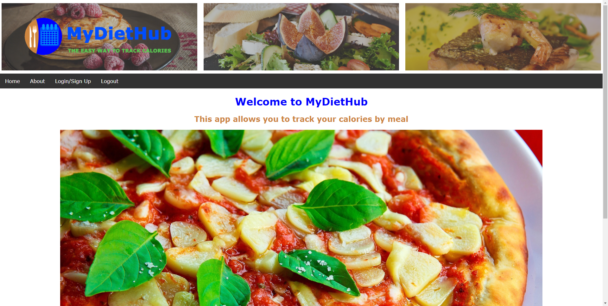
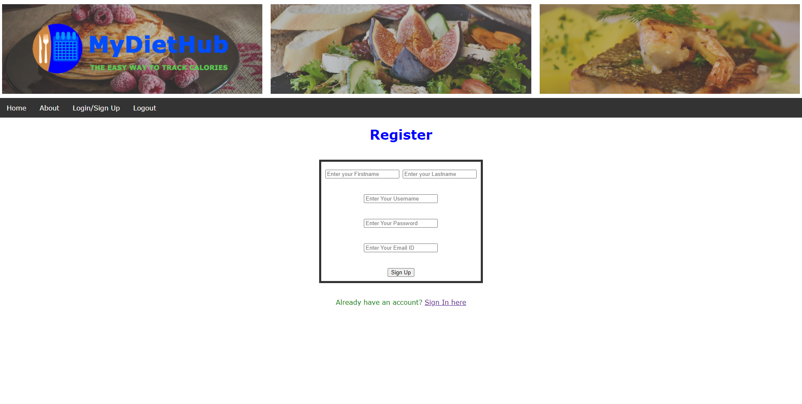
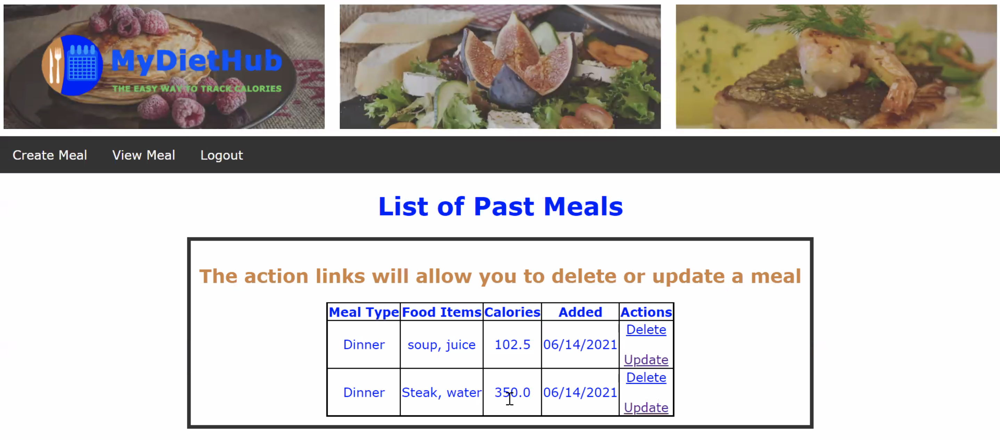

# BUMETCS673OLSum21P4

# Project Information
## Project Name: MyDietHub

## Team Four Members: 
Instructor: Yuting Zhang<br>
Team Leader: Ray Clark<br>
Requirement Leader: Chen Zhao<br>
Design and Implementation Leader: Daniel Graziano<br>
QA Leader: But Wing Han Josephine<br>
Configuration Leader: Huimin Diao<br>
Security Leader: Zixia Zhou<br>
Institution: [Boston University's Metropolitan College](https://www.bu.edu/met/)<br>

## Project Description:
In our project, we plan to build a  **Calorie Tracker**. This application will help the user to calculate their daily calorie counts.<br>
*More details can be found in the documents folder*

# Web Page Preview
- Landing Page


- Register/Login
    
- Food Log



## Project Functions:
We plan to build two main functions about our web application project.
- To let the user enter the food type and food weight, the application will return the calories of the food and the total calories of the meal, then application will display a warning or suggestion if the total calories is over.
- To let the user enter the age, weight and height and the application will calculate the BMI, then according to the BMI, the application will recommend some food or amount of calories the user can take.<br>


# Requirements
- Python 3.8+
- mysql
- flask 2.0.1+


# Notes on mysql
On OSX, mysql can be easily installed using homebrew by the command:
```angular2html
brew install mysql
```
On Windows, mysql can be installed from binary sources.

# Running instructions
After the above requirements are met, the following steps will run the app
- clone repository
- navigate to cloned folder
- create virtualenv with `venv <NAME>` and activate it
- `pip install -r requirements.txt`
- navigate to app folder and type `flask run`
- go to link and port specified in console using a browser to see the app


